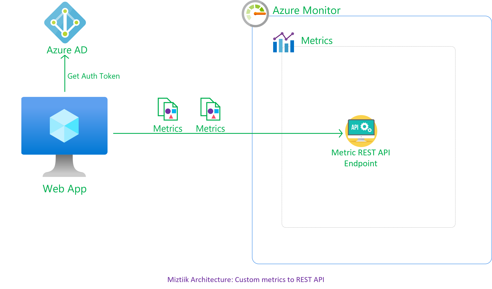
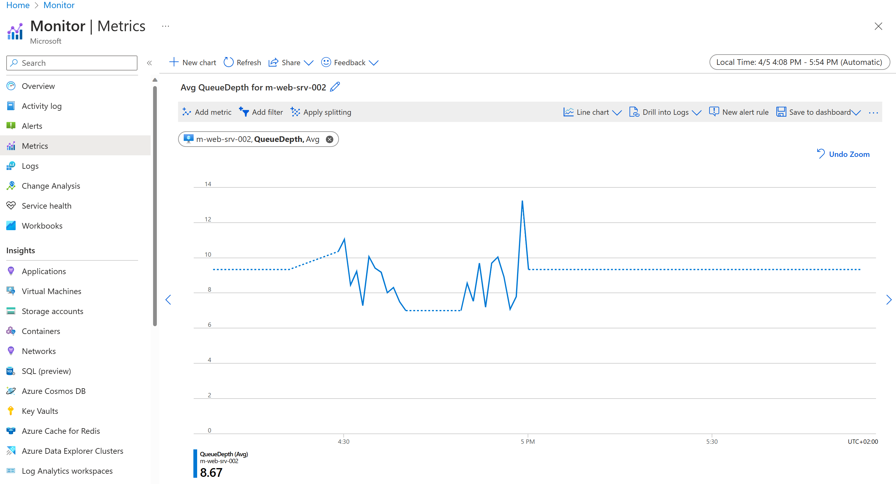

# Custom Metrics to Azure Monitor - REST API Endpoint

Developers at Mystique Unicorn are looking for a way to track the performance of their application using custom metrics. Their application is creating the metrics in a JSON format
```json
{
  "time": "2023-04-05T20:36:26",
  "data": {
    "baseData": {
      "metric": "QueueDepth",
      "namespace": "QueueProcessing",
      "dimNames": [
        "QueueName",
        "MessageType"
      ],
      "series": [
        {
          "dimValues": [
            "ImagesToProcess",
            "JPEG"
          ],
          "min": 2,
          "max": 17,
          "sum": 27,
          "count": 3
        }
      ]
    }
  }
}
```
 They are looking for a central way to store and visualize them. Can you show them how the can get started? 

## 🎯 Solution

We can use Azure Monitor Custom metrics<sup>[1]</sup> for our solution. These can be performance metrics or business/app specific. We have multiple ways of doing so, the most common ways are

1. Bootstrapping the application with Azure Application Insights SDK to send custom telemetry
1. Using Azure Monitor Agent<sup>[2]</sup>
1. Send them directly using the Azure Monitor REST API

In this blog, we are going to try out the REST API method. It gets us to understand the flow of things easily and with this knowledge in a later blog we will use the SDK.



1. ## 🧰 Prerequisites

   This demo, instructions, scripts and bicep template is designed to be run in `westeurope`. With few or no modifications you can try it out in other regions as well(_Not covered here_).

   - 🛠 Azure CLI Installed & Configured - [Get help here](https://learn.microsoft.com/en-us/cli/azure/install-azure-cli)
   - 🛠 Bicep Installed & Configured - [Get help here](https://learn.microsoft.com/en-us/azure/azure-resource-manager/bicep/install)
   - 🛠 VS Code & Bicep Extenstions - [Get help here](https://learn.microsoft.com/en-us/azure/azure-resource-manager/bicep/install#vs-code-and-bicep-extension)

1. ## ⚙️ Setting up the environment

   - Get the application code

     ```bash
     https://github.com/miztiik/custom-metrics-to-azure-monitor
     cd custom-metrics-to-azure-monitor
     ```

1. ## 🚀 Prepare the environment

   Let check you have Azure Cli working with 

    ```bash
      # You should have azure cli preinstalled
      az account show
    ```

    You should see an output like this,

   ```json
    {
      "environmentName": "AzureCloud",
      "homeTenantId": "16b30820b6d3",
      "id": "1ac6fdbff37cd9e3",
      "isDefault": true,
      "managedByTenants": [],
      "name": "YOUR-SUBS-NAME",
      "state": "Enabled",
      "tenantId": "16b30820b6d3",
      "user": {
        "name": "miztiik@",
        "type": "user"
      }
    }
   ```

1. ## 🚀 Deploying the application

    - **Register an App to Azure AD** - Doc Ref<sup>[3]</sup>
      - Create the client secret as well. Note down its value, as it is only shown during the creation time.
    - **Create & Authorize a Service Principal to emit metrics** (_preferably a VM/FunctionApp_)Doc Ref<sup>[4]</sup>
      - Follow the rest of the instructions
    - **Get Auth Token**:

        ```bash
        #Get TenantID
        az account show
        # or
        az account tenant list
        ```

      I have wrapped the instructions into a small bash script `push_custom_metrics.sh`. It will get the Auth Token from AAD, create a metric on JSON format with random values and make a `POST` request to the REST API to push the custom metric. The script will emit `10` metrics by default with `5` second interval between them. Adjust accordingly to your experimentation needs. _Ofcourse update the Id, Secrets, ResourceID as needed_

        ```bash
        #!/bin/bash
        set -x

        SLEEP_AT_WORK_SECS=5
        LOG_COUNT=10
        RES_LOCATION="westeurope"
        HOME_TENANT_ID=$(az account show --query homeTenantId -o tsv)
        APP_CLIENT_ID="50606203bc"
        APP_CLIENT_SECRET="x.J8Q~gc83"

        RESP=$(curl -X POST "https://login.microsoftonline.com/${HOME_TENANT_ID}/oauth2/token" \
        -H "Content-Type: application/x-www-form-urlencoded" \
        --data-urlencode "grant_type=client_credentials" \
        --data-urlencode "client_id=${APP_CLIENT_ID}" \
        --data-urlencode "client_secret=${APP_CLIENT_SECRET}" \
        --data-urlencode "resource=https://monitor.azure.com")

        ACCESS_TOKEN=$(echo $RESP | jq -r '.access_token')
        echo $ACCESS_TOKEN
        VM_RES_ID="subscriptions/1e3/resourceGroups/Miztiik_Enterprises_custom_metrics_to_azure_monitor_002/providers/Microsoft.Compute/virtualMachines/m-web-srv-002"
        # VM_RES_ID=$(curl -H Metadata:true --noproxy "*" "http://169.254.169.254/metadata/instance/compute/resourceId?api-version=2021-05-01&format=text")
        ACCESS_TOKEN1="eyJ0eXAiOrWCAtgHzh6Jf0vTFA"


        for ((i=1; i<=LOG_COUNT; i++)); do

            # Set variable values
            CURR_TIME=$(date +"%Y-%m-%dT%H:%M:%S")
            TIME_TWO_HRS_AGO=$(date -d "-2 hours" +"%Y-%m-%dT%H:%M:%S") 
            METRIC="QueueDepth"
            NAMESPACE="QueueProcessing"
            QUEUE_NAME="ImagesToProcess"
            MESSAGE_TYPE="JPEG"
            MIN=$(shuf -i 1-10 -n 1)
            MAX=$(shuf -i 11-20 -n 1)
            SUM=$(shuf -i 21-30 -n 1)
            COUNT=$(shuf -i 1-5 -n 1)

            # Build JSON string
            JSON_DATA="{\"time\":\"$CURR_TIME\",\"data\":{\"baseData\":{\"metric\":\"$METRIC\",\"namespace\":\"$NAMESPACE\",\"dimNames\":[\"QueueName\",\"MessageType\"],\"series\":[{\"dimValues\":[\"$QUEUE_NAME\",\"$MESSAGE_TYPE\"],\"min\":$MIN,\"max\":$MAX,\"sum\":$SUM,\"count\":$COUNT}]}}}"

            echo "$JSON_DATA"

            curl --write-out %{http_code} -X POST "https://${RES_LOCATION}.monitoring.azure.com/${VM_RES_ID}/metrics" \
            -H 'Content-Type: application/json' \
            -H "Authorization: Bearer $ACCESS_TOKEN" \
            -d "$JSON_DATA"

            sleep $SLEEP_AT_WORK_SECS
        done

        ```

      Make a note of the response, particularly the access token

      - **IMPORTANT** - Do not forget to update the `time` parameter in the json. This should 30minutes behind UTC or 4minutes in the future. But always from **UTC** time.


1. ## 🔬 Testing the solution

   - **Connect to the VM**

      Chart the metric from Azure Monitor Portal

      
  
     
1. ## 📒 Conclusion

    Here we have demonstrated how to push custom metrics to the REST API.
  

1. ## 🧹 CleanUp

If you want to destroy all the resources created by the stack, Execute the below command to delete the stack, or _you can delete the stack from console as well_

- Resources created during [Deploying The Application](#-deploying-the-application)
- _Any other custom resources, you have created for this demo_

```bash
# Delete from resource group
az group delete --name Miztiik_Enterprises_xxx --yes
# Follow any on-screen prompt
```

This is not an exhaustive list, please carry out other necessary steps as maybe applicable to your needs.

## 📌 Who is using this

This repository aims to show how to Bicep to new developers, Solution Architects & Ops Engineers in Azure.

### 💡 Help/Suggestions or 🐛 Bugs

Thank you for your interest in contributing to our project. Whether it is a bug report, new feature, correction, or additional documentation or solutions, we greatly value feedback and contributions from our community. [Start here](/issues)

### 👋 Buy me a coffee

[](https://ko-fi.com/Q5Q41QDGK) Buy me a [coffee ☕][900].

### 📚 References


1. [Azure Docs: Azure Custom Metrics][1]
1. [Miztiik Blog: Send custom metrics from Vm to Azure Monitor using AMA][2]
1. [Azure Docs: Register App to get Auth Tokens from AAD][3]
1. [Azure Docs: Send custom metrics to the Azure Monitor metrics store by using a REST API][4]

### 🏷️ Metadata


**Level**: 100

[1]: https://learn.microsoft.com/en-us/azure/azure-monitor/essentials/metrics-custom-overview
[2]: https://github.com/miztiik/send-vm-logs-to-azure-monitor
[3]: https://learn.microsoft.com/en-us/azure/azure-monitor/logs/api/register-app-for-token?tabs=portal
[4]: https://learn.microsoft.com/en-us/azure/azure-monitor/essentials/metrics-store-custom-rest-api#create-and-authorize-a-service-principal-to-emit-metrics


[100]: https://www.udemy.com/course/aws-cloud-security/?referralCode=B7F1B6C78B45ADAF77A9
[101]: https://www.udemy.com/course/aws-cloud-security-proactive-way/?referralCode=71DC542AD4481309A441
[102]: https://www.udemy.com/course/aws-cloud-development-kit-from-beginner-to-professional/?referralCode=E15D7FB64E417C547579
[103]: https://www.udemy.com/course/aws-cloudformation-basics?referralCode=93AD3B1530BC871093D6
[899]: https://www.udemy.com/user/n-kumar/
[900]: https://ko-fi.com/miztiik
[901]: https://ko-fi.com/Q5Q41QDGK